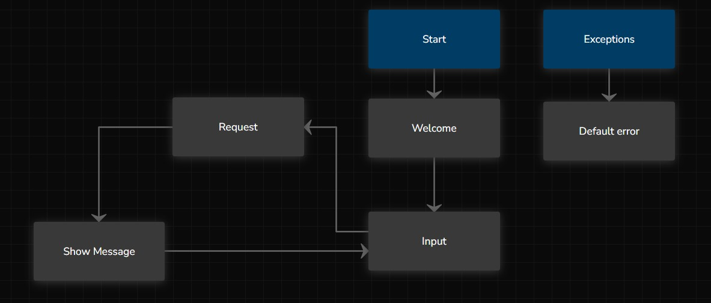

<div style="text-align: center;">
    <a href="https://facilit.com.br/plataforma-target/" target="_blank">
        
    </a>
</div>

# Chatbot Manu
O projeto "Chatbot Manu" desenvolve uma solução de inteligência artificial que permite aos gestores públicos interagir com o sistema Target por meio de um robô conversacional. Ele oferece acesso rápido a resumos, listas e gráficos sobre a gestão de projetos governamentais, simplificando consultas e melhorando a experiência do usuário. O objetivo principal é facilitar o acesso a informações e ferramentas analíticas, promovendo uma tomada de decisão mais eficiente com insights gerados automaticamente.

<div style="text-align: center;">
    
</div>

## Índice
- [Chatbot Target](#chatbot-target)
  - [Índice](#índice)
    - [Descrição](#descrição)
- [Equipe de Desenvolvimento](#equipe-de-desenvolvimento)
  - [2. Objetivos do Projeto](#2-objetivos-do-projeto)
  - [3. Tecnologias Utilizadas](#3-tecnologias-utilizadas)
  - [4. Como Executar o Projeto](#4-como-executar-o-projeto)
    - [Pré-requisitos](#pré-requisitos)
- [Variavel de ambiente via .env](#variavel-de-ambiente-via-env)
      - [**Guia de Uso com `process.env` no projeto chatbot**](#guia-de-uso-com-processenv-no-projeto-chatbot)
    - [**Passo a Passo para Configurar o `.env`**](#passo-a-passo-para-configurar-o-env)
      - [**Benefícios do `.env`**](#benefícios-do-env)
- [**Estrutura do Código**](#estrutura-do-código)
- [**Integração com o Blip**](#integração-com-o-blip)
    - [**Principais Características do Blip no Chatbot:**](#principais-características-do-blip-no-chatbot)
    - [Diagrama Representativo do Fluxo de Dados](#diagrama-representativo-do-fluxo-de-dados)
    - [Contato](#contato)

---
### Descrição
- **Nome do Projeto**: Chatbot Manu
- **Cliente**: Facilit
- **Facilitador**: André Ribeiro

# Equipe de Desenvolvimento

<table>
  <tr>
    <td align="center">
      <a href="https://github.com/ThiagoPortela23">
        
        <br>
        <b>Thiago Portela</b>
      </a>
    </td>
    <td align="center">
      <a href="https://github.com/LucasCA-Git">
        
        <br>
        <b>Lucas C Alecrim</b>
      </a>
    </td>
    <td align="center">
      <a href="https://github.com/LailaMiranda">
        
        <br>
        <b>Laila Miranda</b>
      </a>
    </td>
    <td align="center">
      <a href="https://github.com/marczlle">
        
        <br>
        <b>Marcelle Castro</b>
      </a>
    </td>
    <td align="center">
      <a href="https://github.com/rebecavitoria45">
        
        <br>
        <b>Rebeca Vitorio</b>
      </a>
    </td>
    <td align="center">
      <a href="https://github.com/byrogeriosev">
        
        <br>
        <b>Rogerio Júnior</b>
      </a>
    </td>
    <td align="center">
      <a href="https://github.com/sawnaii">
        
        <br>
        <b>Sarah Mignac</b>
      </a>
    </td>
    <td align="center">
      <a href="https://github.com/CabralWalter">
        
        <br>
        <b>Walter Cabral</b>
      </a>
    </td>
  </tr>
</table>

## 2. Objetivos do Projeto

- **Facilitar o acesso à informação**: Proporcionar uma maneira simples e rápida para que gestores públicos possam obter dados relevantes.
- **Melhorar a experiência do usuário**: Criar uma interface intuitiva que permita interações naturais e fluídas com o sistema.
- **Automatizar a geração de relatórios**: Desenvolver funcionalidades que permitam a produção automática de resumos e análises.

## 3. Tecnologias Utilizadas


- **Node.js**: Para desenvolvimento do servidor e do chatbot.
- **Express**: Framework web para facilitar a construção da API.
- **OpenAI API**: Para processamento de linguagem natural e geração de respostas do chatbot.
- **json-server**: Utilizado para simular um banco de dados RESTful, com dados armazenados em um arquivo JSON. Permite criar, atualizar, ler e deletar dados por meio de uma API simples para fins de desenvolvimento e testes.
- **Frontend**: Tecnologias como HTML, CSS e JavaScript para a interface do usuário, enquanto utilizamos para teste do ChatBot.
- **dotenv**: Carrega variáveis de ambiente de um arquivo `.env`, como a chave da API da OpenAI, garantindo a segurança de informações sensíveis e permitindo fácil configuração de variáveis para diferentes ambientes (desenvolvimento, produção, etc.).

## 4. Como Executar o Projeto

### Pré-requisitos

1. Certifique-se de ter o Node.js instalado em sua máquina.


   - Já existe o script para isso:
   ```json
   "scripts": {
       "install": "npm install express openai fs path dotenv && npm install --save-dev @types/express",
       "start": "node app.js"
   },
   ```
   
2. Instale as dependências necessárias.

```bash
npm install
```

3. Realize a conexão com o banco
```bash
npm start
```

---
# Variavel de ambiente via .env

utilizando o `.env` para a chaveda openAI acessivel apenas para os integrantes que tem o arquivo .env localmente, evitando assim utilizar a chavendo dentro do codigo durante o desenvolvimento do projeto, impedindo que dados confidenciais fiquem expostos diretamente no código-fonte, tornando-o mais seguro e modular.

#### **Guia de Uso com `process.env` no projeto chatbot**

No exemplo abaixo, a chave da API da OpenAI é armazenada em uma variável de ambiente chamada `OPENAI_API_KEY`. Em vez de definir a chave diretamente no código, ela é lida do ambiente, o que mantém a chave privada e segura:

```js
const apiKey = process.env.OPENAI_API_KEY;
```
### **Passo a Passo para Configurar o `.env`**

- **Crie um arquivo `.env`** na raiz do seu projeto.

**Defina a variável de ambiente** dentro do arquivo `.env`, associando-a ao valor necessário. Por exemplo:  
```
OPENAI_API_KEY= DIGITE AQUI O CODIGO
```
  

- **Carregue o `.env`** no seu projeto usando o pacote `dotenv`, que permite que as variáveis definidas no arquivo sejam carregadas no ambiente `process.env`:  
```js
require('dotenv').config();
```


- Agora, você pode acessar `process.env.OPENAI_API_KEY` em qualquer parte do seu código, sem precisar expor o valor diretamente.

#### **Benefícios do `.env`**

* **Segurança**: Protege informações sensíveis, garantindo que não sejam expostas no código-fonte.  
* **Facilidade de Configuração**: Permite alterar valores rapidamente, sem a necessidade de modificar o código.  
* **Versatilidade**: Facilita a troca de chaves de API entre ambientes (desenvolvimento, teste, produção).

---

# **Estrutura do Código**

A arquitetura do projeto está organizada de forma modular, facilitando a manutenção e escalabilidade:

1. **`config/api.js`**:  
   * Contém a lógica de integração com a API da OpenAI e funções para carregar dados de arquivos JSON e MD (como `db.json` e `facilitinfo.md`).  
   * Separa a lógica de configuração da aplicação principal.  
2. **`data/`**:  
   * Guarda dados estáticos como `db.json` (informações sobre o banco de dados) e `facilitinfo.md` (informações sobre a empresa).  
   * Permite acessar dados importantes de forma centralizada.  
3. **`public/`**:  
   * Armazena arquivos estáticos, como CSS e imagens (`gpt.jpg`, `user.png`), que são acessíveis pelo navegador para a interface do usuário.  
   * Contém o layout visual do chatbot e seus elementos gráficos.  
4. **`app.js`**:  
   * Arquivo principal, onde o servidor é configurado e as rotas da API são definidas.  
   * Estabelece a conexão entre a lógica do backend e a interface do frontend.  
5. **`index.html`**:  
   * Widget disponibilizado pela plataforma Blip, onde é mostrado toda a interface gráfica.

---

# **Integração com o Blip**

O Chatbot Manu está integrado ao sistema **Blip**, uma plataforma de comunicação robusta e amplamente reconhecida. Essa integração permite ao chatbot processar perguntas e oferecer respostas claras e objetivas, utilizando o modelo de mensagens estruturadas e formato JSON.

Essa funcionalidade aprimora a experiência de interação dos usuários com o sistema, garantindo respostas rápidas e precisas. O sistema já está configurado para atender às necessidades específicas do cliente e foi desenvolvido para facilitar o acesso às informações.


### **Principais Características do Blip no Chatbot:**
- **Processamento Inteligente de Perguntas:** Permite entender e interpretar perguntas feitas por usuários, mesmo em formatos variados.
- **Formato Estruturado (JSON):** Respostas organizadas que podem ser facilmente integradas a outros sistemas.
- **Interação Natural:** Promove uma experiência fluida para o usuário, simulando uma conversa real.
- **Multicanal:** Suporte para operar em diversas plataformas sem a necessidade de retrabalho no código base.


### Diagrama Representativo do Fluxo de Dados  




O **ChatBot Manu** é uma solução inovadora que combina tecnologia de ponta e praticidade para transformar o atendimento ao cliente. Desenvolvido com foco nas necessidades do **Target**, o chatbot proporciona um atendimento mais rápido, eficiente e personalizado. 

A integração com a plataforma **Blip** potencializa a experiência do usuário, oferecendo respostas rápidas e precisas, ao mesmo tempo que automatiza processos internos, garantindo mais eficiência e produtividade para a empresa.


---

<div align="center">
    <a href="https://facilit.com.br/plataforma-target/" target="_blank">
        
    </a>
</div>

---


### Contato
Se tiver dúvidas ou sugestões, entre em contato com a equipe:  

- **Facilit**: [facilit.com.br](https://facilit.com.br/plataforma-target/)  
- **GitHub do Projeto**: [github.com/Chatbot-Target](https://github.com/softexrecifepe/PI-FACILIT-TURMA-04-GRUPO-01?tab=readme-ov-file#estrutura-do-código)  

💻 Feito por [Thiago Portela](https://github.com/ThiagoPortela23), [Lucas Alecrim](https://github.com/LucasCA-Git), [Laila Miranda](https://github.com/LailaMiranda), [Marcelle Castro](https://github.com/marczlle), [Rebeca Vitorio](https://github.com/rebecavitoria45), [Rogerio Júnior](https://github.com/byrogeriosev), [Sarah Mignac](https://github.com/sawnaii) e [Walter Cabral](https://github.com/CabralWalter).

